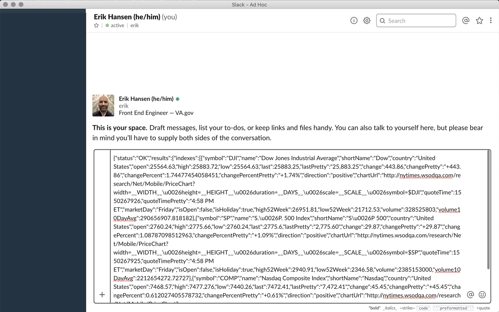

# Prettierify LaunchBar action

This is a LaunchBar action that formats code snippets using [Prettier](https://prettier.io).

## Motivation

From time to time I find myself needing to paste arbitrary snippets of code (JSON usually) into Slack and want it to be nicely formatted before I share it. My usual workflow for this is to: paste it in a new VSCode doc, set the doc's language mode, run the formatter, copy the formatted selection, and then paste it into Slack.

Now I can copy the poorly formatted text, run it through this action, and paste it right back where I copied it from.

## Usage

1. Get the text you want to format into LaunchBar, either via [Instant Send](https://www.obdev.at/resources/launchbar/help/InstantSend.html) or via the clipboard history.
2. Hit `tab`, start typing `prettierify`, and hit `enter` on the Prettierify action.
3. Select the language you want to format your text as.
4. You now have two options. If you just hit `enter`, your formatted text will be returned to LaunchBar as a series of items, one for each line in your formatted text. But since you'll likely want to paste the entire formatted text somewhere, you can instead hit `shift-enter` to paste the text in the active app.

## Notes

- If you have a `.prettierrc` file in your home directory, this action will format text with the prefs you've set there. Otherwise it will use the Prettier defaults.

## Installation

Simply clone this repo into your LaunchBar actions directory (`~/Library/Application Support/LaunchBar/Actions`). Even though the actual `Prettierify.lbaction` won't live at the top level of the LaunchBar actions directory, LaunchBar is smart enough to search all subdirectories for `.lbaction` extensions.

Alternatively, if you just want to _use_ this action and not make any changes to it, you can <a href="./build/Prettierify.lbaction" download>download just the `Prettierify.lbaction` file</a> and move it to your LaunchBar actions directory.

## Development

### Getting set up

1. Clone the repo to your computer and install the action as [described above](#Installation)
2. Run `npm install` to get the dependencies

### Making changes

1. Edit the code in `Contents/Resources`. **DO NOT** modify the `main.js` file as that's generated by Webpack during the build process.
2. Run `npm run watch` (or `yarn watch` if you prefer)
3. Run the action in LaunchBar to see your changes

### About the build process

This extension uses Webpack for two reasons:

1. So we can write modern JS and compile it into JS that LaunchBar can handle
2. But primarily to bundle Prettier and all of the required Prettier parsers together with our code into a single script

If you dig into the very simple build process you'll notice that after Webpack builds the `main.js` file, `exposeFunctions.sh` runs, adding additional code to the end of the `main.js`. This is done because LaunchBar needs a top-level `run` function to call. Because `run` in turn looks for the `format` function, `format` also needs to live as a top-level function in `main.js`.
